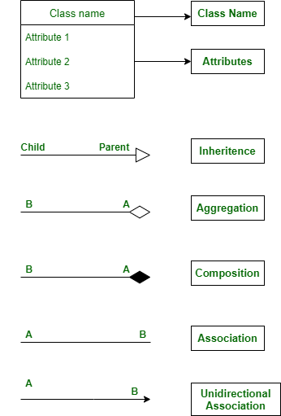

# Class Diagram

### What it shows:

- The static structure of the system: classes, attributes, methods, and relationships.

- Think of it as the skeleton of your program.

### Why interviews love it:

- Tests your OOP thinking (inheritance, composition, association).

- Helps explain how objects connect in your design.

## Class Diagram Basics

ClassName → the name of the class

Attributes (with visibility & type)

Methods (with visibility, params, return type)

👉 Visibility symbols:
- \+(plus) -> Public  
- \- (minus) -> Private  
- \#(hash) -> Protected

## Relationship in class diagram

### 1. Association
Association represents a "can call" or "uses" relationship between two classes, where both classes can interact with each other (bidirectional) or one class can interact with another (unidirectional)

**Directional Association:** presented by a simple line between two classes, implying both can call each other.A can call B and B can also call A. 
- **Example:** A Train and a TrainStation can both access or call each other.

**Unidirectional Association:** Represented by a line with an arrow pointing from the calling class to the called class. A->B mean A can call B but B can't call A.
- **Example:** A Person can access a Desktop, but the Desktop cannot access the Person

**Multiplicity:** Denotes how many instances of one class are related to instances of another class. It is shown by numbers or ranges on the association line.
- 1: Exactly one instance. 
- 0..1: Zero or one instance.
- 1..*: One or many instances.
- *: Zero or many instances (any number). 
- **Example:** A Room can have 1..4 Riders (persons) or a Driver can have 1 Cab

**Roles:** Sometimes, a label is placed on the association line to specify the role a class plays in the relationship, often using "uses" or a descriptive role name. 
- **Example:** In a Cab and Driver relationship, the Driver "drives" the Cab, and the Rider "rides" the Cab

---
### 2. Aggregation
Aggregation represents a "has a" relationship where one class (the whole) contains another class (the part), but the part can exist independently of the whole. It's a "weak" ownership. A can exist without B.B also exist without A.

The "part" object can exist even if the "whole" object is destroyed.

- **Examples:** 
1. A Person "has a" House. If the Person object is destroyed, the House object can still exist independently. 
2. Desktop and a Monitor, where the Monitor can exist without being attached to a specific Desktop
---

### 3. Composition
Composition is a stronger "has a" relationship where the "part" class cannot exist without the "whole" class. The lifecycle of the part is dependent on the whole; if the whole is destroyed, the part is also destroyed. B can't exist without A. A can exist without B.

The "part" is an integral part of the "whole" and cannot exist independently.

- **Examples:**
1.  A Body "has an" Eye. An Eye cannot exist without a Body. When the Body object is created, the Eye object is created, and when the Body is destroyed, the Eye is also destroyed.
2. Another example is a Desktop and a Motherboard, where the Motherboard is essential for the Desktop's existence.

---
### 4. Inheritance (Generalization)
Inheritance represents an "is a" relationship, where a child class inherits properties and behaviors from a parent class. This promotes code reusability and establishes a hierarchy between classes.

- **Example:** A Person "is a" LivingBeing, and an Animal "is a" LivingBeing.

---
