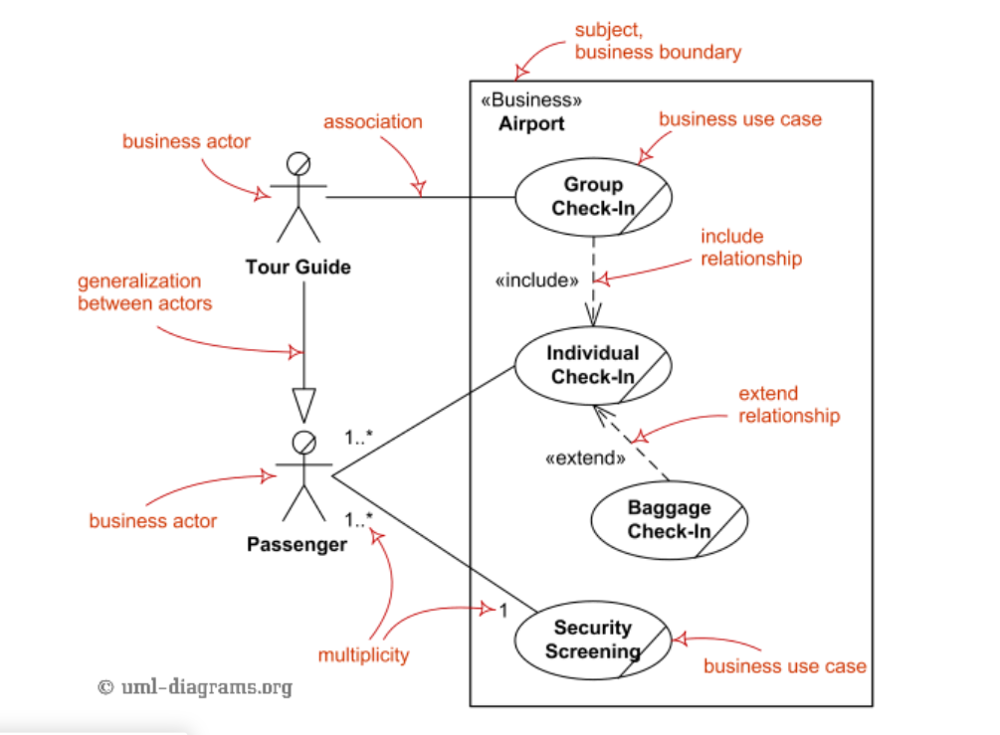

# UML Use Case Diagram – Actors & Actions Made Simple

Use Case diagrams visualize **who interacts with the system** and **what the system does**.  
They are ideal for explaining system functionality to both **technical and non-technical stakeholders**.

---

##  Main Elements

### 1. Actor
- Represents a **role interacting with the system**, not a specific person.  
- **Notation:** Stick figure  

**Examples:**  
- Customer   
- Clerk  
- Administrator   
- Payment Service   

---

### 2. Use Case
- Represents a **functionality or action** performed by the system.  
- **Notation:** Oval  

**Examples:**  
- Checkout  
- Payment  
- Help  
- Manage Users  

---

### 3. System Boundary
- Rectangle enclosing use cases.  
- Shows **what is part of the system**.  
- **Notation:** Rectangle labeled with system or subsystem name (e.g., «Subsystem» Checkout)

---

## Relationships

1. **Association (solid line)**  
   - Connects **actor → use case**.  
   - Shows participation.  
   - **Multiplicity** can indicate “one or many” instances.  

2. **Include («include») (dashed arrow)**  
   - Represents **mandatory sub-process**.  
   - Always happens **as part of the base use case**.  

3. **Extend («extend») (dashed arrow)**  
   - Represents **optional or conditional behavior**.  

4. **Generalization (solid line + hollow triangle)**  
   - Shows **inheritance** between actors or use cases.  

---

## Example: Checkout System

- **Actors:** Customer, Clerk, Administrator, Payment Service  
- **Use Cases:** Checkout, Payment, Help, Manage Users  
- **Associations:** Customer participates in Checkout, Clerk participates in Checkout, Payment Service participates in Payment  
- **Include Relationship:** Checkout «include» Payment (mandatory)  
- **Extend Relationship:** Checkout «extend» Help (optional)  
- **Multiplicity:** 1..* for Customer → Checkout, 0..* for Payment → Payment Service  

---

