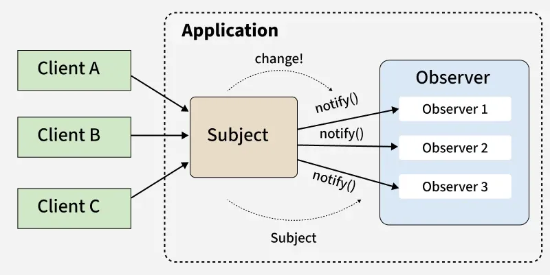

# Observer Design Pattern

The Observer Design Pattern establishes a one-to-many relationship between objects. When one object (the Subject) changes its state, all its dependents (the Observers) are automatically notified and updated.

## How It Works
1. **Subscribe:** Observers register with the Subject to receive updates.
2. **State Change:** The Subject's internal data changes (e.g., a new video is uploaded).
3. **Notify:** The Subject informs all registered Observers about the change.
4. **Update:** Each Observer reacts to the notification, often by fetching the new data from the Subject.

## Real-World Example: YouTube Notifications
- **Subject:** A YouTube Channel.
- **Observers:** Your YouTube Account (and other subscribers). 

When a channel uploads a new video (Subject changes state), it notifies all subscribers (Observers), and your account receives a notification.

## Benefits
- **Loose Coupling:** Subject and Observers don't need to know much about each other, making systems flexible.
- **Scalability:** Easily add new Observers without changing the Subject.
- **Reusability:** Observers can work with different Subjects.

