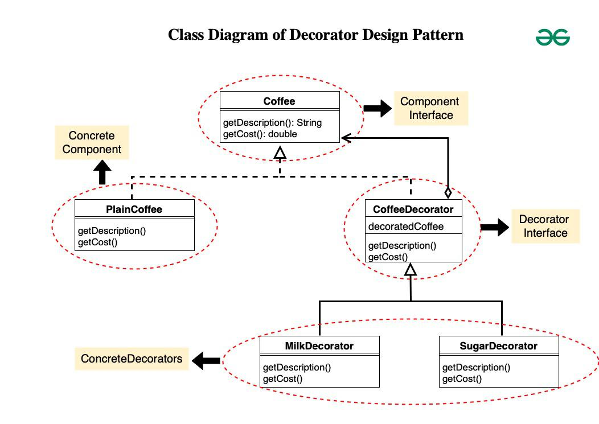

# Decorator Design Pattern

## The Real Problem
Let’s imagine you’re building a Coffee Shop App.

A customer can order a simple coffee.

Some customers want milk, some want sugar, others want whipped cream, and some want all of them together.

### First Attempt: Using Inheritance

You think:
“Okay, I’ll just create classes for each type of coffee.”

So you make:

- `SimpleCoffee`

- `MilkCoffee`

- `SugarCoffee`

- `MilkSugarCoffee`

- `MilkSugarWhippedCreamCoffee`

Problem: The number of combinations explodes.
For every new topping, the number of subclasses doubles. Adding just 5 toppings would create 32 different classes.

This is called the **class explosion problem**.

Inheritance fails here because:
- It’s static → Once a class is defined, its behavior is fixed.

- You cannot mix & match at runtime → What if the customer wants “extra milk” or “no sugar after all”?

- It violates the Open/Closed Principle → To add new behavior, you keep modifying existing code.

## How Decorator Pattern Solves The Problem
The Decorator Pattern lets us wrap an object with another object that adds extra behavior.

Think of it like wrapping gifts:

- The gift inside (base coffee) stays the same.

- But you can decorate it with wrapping paper, ribbons, or stickers to make it look and behave differently.

- You can remove or reorder wrappers without changing the gift itself.

## Structure of the Decorator Pattern

`Component (interface)` → Defines the common behavior (Coffee).

`ConcreteComponent` → The base object (SimpleCoffee).

`Decorator (abstract)` → Has a reference to a component and forwards requests.

`ConcreteDecorators` → Add extra behavior (Milk, Sugar, WhippedCream).

