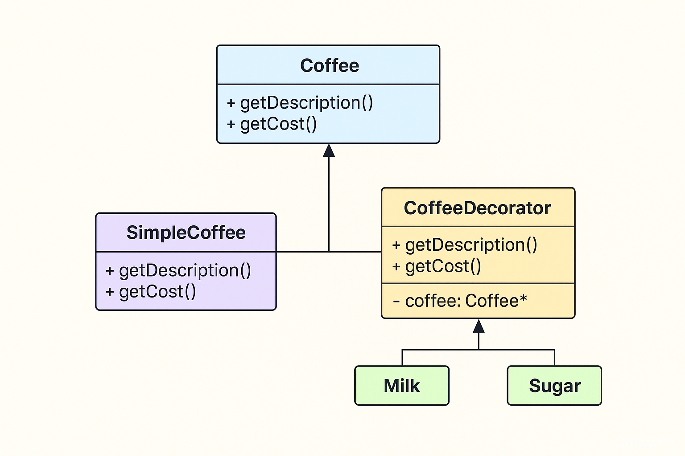

## Explanation of code with decorator pattern

```c++
Coffee* myCoffee = new SimpleCoffee();
```
- Here, `myCoffee` points to a `SimpleCoffee` object.

- `myCoffee->getDescription()` = `"Simple Coffee"`

- `myCoffee->getCost()` = 5

```c++
myCoffee = new Milk(myCoffee);
```
Now, you wrap the old object (`SimpleCoffee`) inside a `Milk` object.

`Milk` is a decorator: it has a pointer/reference to another `Coffee`.

So now `myCoffee` points to `Milk`, but `Milk` internally still calls `SimpleCoffee`.

```c++
myCoffee = new Sugar(myCoffee);
```

Same thing: you wrap the current `coffee` (Milk + SimpleCoffee) with `Sugar`.

Now `myCoffee` points to `Sugar`, but `Sugar` holds a reference to `Milk`, which holds a reference to `SimpleCoffee`.

---

So the chain is:

- `Sugar::getDescription()` → calls `Milk::getDescription()`

- `Milk::getDescription()` → calls `SimpleCoffee::getDescription()`

- `SimpleCoffee::getDescription()` → "Simple Coffee"

**Final result = "Simple Coffee, Milk, Sugar".**

---
```c++
double Sugar::getCost() {
    return wrappedCoffee->getCost() + 0.5;
}
```
- `Sugar::getCost()` = `Milk::getCost()` + 0.5

- `Milk::getCost()` = `SimpleCoffee::getCost()` + 1

- `SimpleCoffee::getCost()` = 5

**Final = 5 + 1 + 0.5 = 6.5**

---

```
Sugar → Milk → SimpleCoffee → returns base → builds up result back
```



---